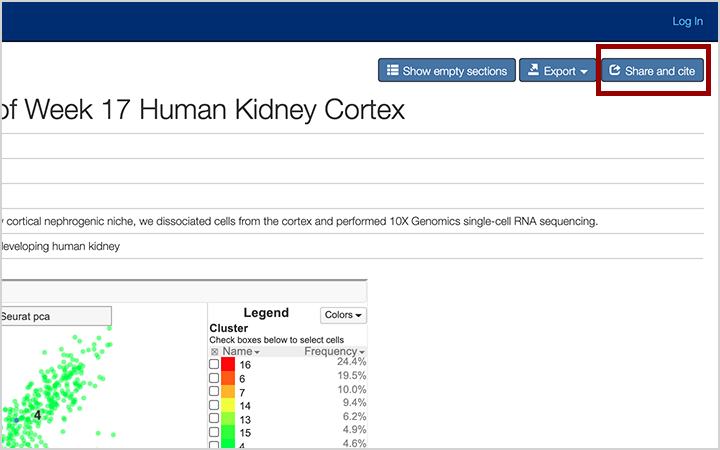
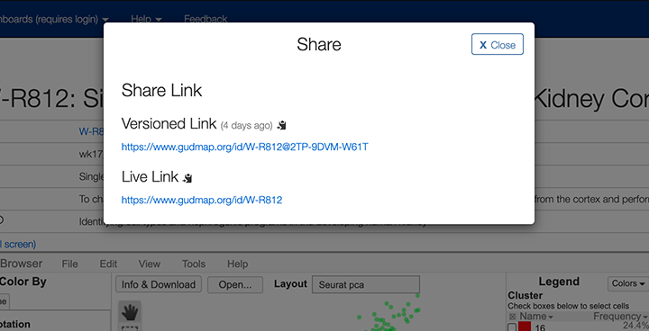

Users of GUDMAP-hosted data are expected to cite the primary publication for the particular data used, as is the accepted norm in scientific publishing. (A full list of papers with data deposited in GUDMAP is [here](/chaise/recordset/#2/Common:Publication/*::facets::N4IghgdgJiBcDaoDOB7ArgJwMYFM6JHQBcAjdafEAYRQFtaUIQAaEABTRIBsBLLMIj0YB9GhFQZBaWsIBmAaxwBPEAF0AvqwBKASQAia1lgAWKPjiSUAigFoAzAGkArADY16jUA@sort(Year::desc::,Month::desc::,RID::desc::)).). In addition, the [GUDMAP consortium](#citing-the-gudmap-consortium-anchor) should be cited, should be cited, along with our permanent identifier links (available via the "Share and cite" button on every data record )or via a generated DOI for a [Data Collection](#creating-citable-data-collections).

The GUDMAP Consortium uses a data citation strategy that has been designed to ensure that all data is Findable, Accessible, Interoperable, and Reproducible (e.g. [FAIR](https://www.go-fair.org/fair-principles/)). As part of this strategy, GUDMAP follows the principles for data citation laid out in [DataCitation](http://blogs.nature.com/scientificdata/2016/07/14/data-citations-at-scientific-data/).

* [Citing the GUDMAP Consortium](#citing-the-gudmap-consortium-anchor)
* [Citing Data Associated with a Publication](#citing-data-associated-with-a-publication-anchor)
* [Citing Data Not Associated with a Publication](#citing-data-not-associated-with-a-publication-anchor)
* [Creating Citable Data Collections](#creating-citable-data-collections-anchor)
* [Data Dissemination/Data Availability Statements](#data-dissemination-data-availability-statements-anchor)
* [Links to GUDMAP Resources](#links-to-GUDMAP-resources-anchor)
* [For Further Information](#for-further-information-anchor)

## Citing the GUDMAP Consortium

In addition to the primary publications, if GUDMAP was utilized for finding data and additional associated data, please cite the consortium using a current consortium papers (see below) in acknowledgment and support of overall consortium efforts.

Harding SD, Armit C, Armstrong J, Brennan J, Cheng Y, Haggarty B, Houghton D, Lloyd-MacGilp S, Pi X, Roochun Y, Sharghi M, Tindal C, McMahon AP, Gottesman B, Little MH, Georgas K, Aronow BJ, Potter SS, Brunskill EW, Southard-Smith EM, Mendelsohn C, Baldock RA, Davies JA, Davidson D. **The GUDMAP database – an online resource for genitourinary research. Development. 2011 Jul; 138(13):2845-53.** [View at PubMed](http://www.ncbi.nlm.nih.gov/pubmed/21652655).

McMahon AP, Aronow BJ, Davidson DR, Davies JA, Gaido KW, Grimmond S, Lessard JL, Little MH, Potter SS, Wilder EL, Zhang P. 2008. **GUDMAP: the genitourinary developmental molecular anatomy project. J Am Soc Nephrol. 19, 667-671.** [View at PubMed](http://www.ncbi.nlm.nih.gov/pubmed/18287559).

## Citing Data Associated with a Publication

To enhance reproducibility and ensure that appropriate credit is made for data creation, data users are *strongly* encouraged to also cite the related data DOIs where appropriate to identify specific data entries for their readers. This creates a durable link from the manuscript to the large datasets that support the analysis and conclusions of the publication.

In support of primary publications, GUDMAP issues individual Digital Object Identifiers (DOIs) that serve as persistent identifiers and links to data *entries* in the GUDMAP data repository. When possible, these DOIs are included in the manuscripts published by consortium members as direct pointers to specific data hosted in the GUDMAP data repository.

Data citations can be included in the bibliography of the paper and cited similarly to other types of publications in a manuscript. The exact format for data citation will vary from journal to journal, but in general, the citation should include:

* Author(s)

* Collection title (Nature data citation format does not specify this field, although other citation formats do recommend including the collection title.).

* Year of publication

* Repository name or publisher, e.g. (Re)Building a Kidney Consortium

* DOI of data set being referenced.

Here is an example of a data citation that conforms to the format recommended by [Nature](http://blogs.nature.com/scientificdata/2016/07/14/data-citations-at-scientific-data/):

[1] Vezina CM (2018) *GUDMAP Consortium*. Available at [https://doi.org/10.25548/W-QXXC](https://doi.org/10.25548/W-QXXC).

which would be used in conjunction with the corresponding paper citation:

[2] Joseph; Diya B. and Chandrashekar; Anoop S. and Abler; Lisa L. and Chu; Li-Fang and Thomson; James A. and Mendelsohn; Cathy and Vezina; Chad M., In vivo replacement of damaged bladder urothelium by Wolffian duct epithelial cells., Proc Natl Acad Sci U S A, 2018, 115 (33) 8394-8399, [https://doi.org/10.1073/pnas.1802966115](https://doi.org/10.1073/pnas.1802966115), [https://www.pnas.org/content/115/33/8394](https://www.pnas.org/content/115/33/8394)

Here is an example of how GUDMAP data and its associated manuscript can be cited in the body of the manuscript:

Apoptotic indices reported in this paper were based on analysis performed on the image data set from Vezina et al. [1] and confirmed the previously published observation of increased cell death in Dnmt1 knockout UGS epithelium [2].

## Citing Data Not Associated with a Publication

In some instances, data in the GUDMAP data repository will be released for public access and not have an associated publication. In this case, authors should use the persistent Record ID (i.e. RID) assigned by GUDMAP (e.g. [https://www.gudmap.org/id/W-QXXC](https://www.gudmap.org/id/W-QXXC)). This citation, which has the same characteristics as a DOI, can be obtained by clicking the "Share and Cite" button on the upper right-hand part of the page for the data to be referenced.

The "Versioned Link" will reference the exact instance of this data while the "Live Link" will reference the current version.

## Creating Citable Data Collections

If you are publishing a paper that uses subsets of GUDMAP data, or aggregates data in new ways, it is desirable to create a new *data collection*. Data collections are a curated set of GUDMAP data organized into one easily citable and referenced location with a Digital Object Identifier (DOI). This collection allows readers to unambiguously obtain full quality, source data that was referenced in the paper, which promotes reproducibility of scientific results.

If you are an GUDMAP project publishing a paper, please [create and reference a "Data Collection" for data](https://github.com/informatics-isi-edu/gudmap-rbk/wiki/Create-citable-datasets) included in your paper and any additional data you wish to be considered relevant to the published project. Follow the above section on how to add your data citation in the bibliography section, and how to cite your data collection in the manuscript.

Researchers outside of the GUDMAP can request the creation of a new collection from existing GUDMAP data by emailing help@gudmap.org.

## Data Dissemination/Data Availability Statements

In addition to including dataset references in the bibliography of your paper, journals are increasingly requiring statements of data accessibility. You can meet this requirement by including text similar to the following in the appropriate section (e.g. Data Availability, Methods, etc.):

>**Data Accessibility** To increase rigor, reproducibility, and transparency, raw image files and other data generated as part of this study were deposited into the GUDMAP consortium database and are fully accessible at: [https://doi.org/10.25548/W-QXXC](https://doi.org/10.25548/W-QXXC) **(25)**.

## Links to GUDMAP Resources

With the exception of the main GUDMAP site ([www.gudmap.org](http://www.gudmap.org/)), links to pages within the site should never be used. Only persistent identifiers such as DOIs or GUDMAP specific identifiers (RIDs) obtained from the "Share and Cite" button (e.g. URLs in the form [https://www.gudmap.org/id/W-QXXC](https://www.gudmap.org/id/W-QXXC)) are guaranteed to work at all times. The GUDMAP repository makes no commitment to maintain links that do not follow these guidelines.

## For Further Information

If you have any questions or wish to create a new GUDMAP data collection, send an email to [help@gudmap.org](mailto:help@gudmap.org).
